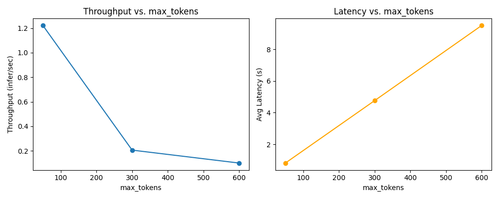

# Tritonserver vLLM Showcase
This repository contains an implementation of a **Llama3-8b-Instruct** model running on a **vLLM** backend, served via **NVIDIA Triton Inference Server**. The Tritonserver API comprises 3 endpoints:
1.  **`llama3-8b-instruct`**, a vLLM-backed endpoint providing the model’s “generate” functionality.
2. **`llama_postprocess`**, provides output censorship and guardrails, censoring profanity or offensive model responses.
3. **`llama_bls_ensemble`**, a **manual BLS pipeline** that integrates preprocessing guardrails (blocking profane requests) and calls the above two endpoints sequentially. Because direct Triton ensembles aren’t fully supported with the vLLM backend, this implementation relies on **Business Logic Scripting** (BLS) inside a Python backend.

This design yields a **3-step pipeline**:
1. **Preprocessing** checks user input for profanity/offensive content.  
2. **LLM Inference** with the Llama model.  
3. **Postprocessing** to censor any offensive output.

The service is provided as an **HTTP/gRPC API** in **Docker**, running on an **NVIDIA GPU (RTX 4090)**.

### Triton Inference Server

**NVIDIA Triton Inference Server** was chosen as a framework to provide vLLM serving because it provides:

- **Built-In Scheduler and Load Balancer**: Automatically handles concurrency, batching, and GPU resource usage.  
- **Built-In Performance Analysis**: The `perf_analyzer` tool helps evaluate latency, throughput, and advanced metrics (p50 - p99) under different loads.  
- **HTTP and gRPC Endpoints**: Out of the box, Triton can serve models over both protocols.  
- **Easy Scalability**: Through configuration or tools like Helm charts, you can replicate or autoscale the server as needed.  
- **Simple Integration**: For example, we can add more models or switch between different versions with minimal changes to config.
- **Highly optimized**: Triton Inference Server is one of the most compute optimized ML inference serving frameworks.
- **Integrated monitoring**: Triton exposes hardware, endpoint and queue metrics on an HTTP port out of the box, which is easily scraped with Prometheus and visualized and monitored in Grafana.

## 1. Repository Overview

The repository is split into a few main areas:

1. **Docker** and deployment scripts
2. **Docs** (including performance graphs)
3. **Model data** (local cache for Llama-3-8B)
4. **Source code** for Tritonserver, including the model repository
5. **Tests** for integration, performance, and unit checks.

Below is a quick description of each top-level directory:

- `docker/` \
Contains Dockerfiles and Compose files. The main docker-compose.yml orchestrates the Tritonserver container plus and can be extended to include additional services such as monitoring with prometheus and grafana.

- `docs/` \
Holds reference images and performance graphs.

- `models/` \
Stores locally downloaded Hugging Face model artifacts (Llama3-8B), so they won’t have to be re-fetched each time.

- `src/tritonserver/` \
The core code for starting and configuring Triton Inference Server. Inside, you’ll find:

  - `entrypoint.sh`: A script that pulls the model from  the Huggingface Hub if needed, launching Triton afterwards.
  - `model_repository/`: This folder follows the official directory structure where Triton looks for models (including version subfolders and config.pbtxt files).
- `tests/` \
Contains API integration tests, performance test scripts (perf_analyzer data JSONs), and unit tests for guardrails and Python logic.

### Triton Model Repository Structure
A key aspect of Triton is its model repository. Under src/tritonserver/model_repository, each top-level folder is a “model.” Within each model folder, subfolders like 1/ or 2/ represent versions of that model. For Python or custom backends, each version folder contains:

- A model.py (the main Python backend entry point).
- Additional code for BLS or guardrail logic.
- Optional helper scripts (e.g., preprocess.py).
- A config.pbtxt in the model’s root (outside the version folder) that declares shapes, datatypes, input/output names, etc.

Hence, the structure is:

```txt
model_repository/
 ├── <model_name_1>/
 │    ├── config.pbtxt
 │    └── 1/
 │         ├── model.py
 │         └── any_other_files.py
 ├── <model_name_2>/
 │    ├── config.pbtxt
 │    └── 1/
 │         └── ...
 └── ...
```

Specifically for this repo:

1. `llama3-8b-instruct/`:
    - `config.pbtxt`: Instructs Triton about inference backend, tensor names, input/output shapes, datatypes, instance scaling and accelerator parameters (GPU/CPU specific).
    - `1/model.json`: A JSON that references the actual Llama model for vLLM and details its settings.
2. `llama_bls_ensemble/`:
    - `config.pbtxt`: Instructs Triton about inference backend, tensor names, input/output shapes, datatypes, instance scaling and accelerator parameters (GPU/CPU specific).
    - `1/model.py`: Tensor processing, decoding and encoding logic and the BLS logic that calls the LLM endpoint plus the postprocess endpoint.
    - `1/preprocess.py`: profanity/banned language check logic for input.
3. `llama_postprocess/`:
    - `config.pbtxt`: Instructs Triton about inference backend, tensor names, input/output shapes, datatypes, instance scaling and accelerator parameters (GPU/CPU specific).
    - `1/model.py`: Tensor processing logic
    - `1/model_guardrails.py`: Output censorship to limit what the LLM can produce.

### Guardrails (Input & Output)

- **Preprocessing** uses `better_profanity` and a simple banned-word list to *block or sanitize user queries*.  
- **Postprocessing** uses a similar approach to censor the model’s final text.  
- For advanced or domain-specific safety checks, the Tritonserver ecosystem could be expanded with additional classification models, which can be integrated similarly via BLS. Alternatively, more advanced solutions are provided by managed services such as [guardrails](https://www.guardrailsai.com/).

### Why Manual BLS Instead of an Ensemble?

Triton typically supports [ensemble models](https://github.com/triton-inference-server/server/blob/main/docs/architecture.md#ensemble) for chaining endpoints without extra overhead. However, the **vLLM** backend used here **doesn’t** yet fully support direct ensemble usage. Hence the reliance on **Business Logic Scripting** inside a Python backend to manually call:

1. Preprocess
2. LLM Inference
3. Postprocess

This does introduce some scheduling inefficiencies (requests block while making BLS calls). If official ensemble support for vLLM appears later, the BLS logic can be pivoted to a standard ensemble pipeline with better concurrency.

---

## 2. Setup & Deployment

### Requirements
- **NVIDIA GPU** with ~22–24 GB of memory available (e.g., an RTX 4090, this stack was tested with CUDA 12.6).
- A **Hugging Face** account with **access** to “Meta-Llama-3-8B-Instruct,” and you **must**  create a .env file in the root of this repository and add the line `HUGGINGFACE_HUB_TOKEN={your_hf_token}`, where `your_hf_token` is replaced with your HF hub token.

### Building & Running

1. Spin Up the Tritonserver:
   ```bash
   docker compose -f docker/docker-compose.yml --env-file ./.env up --build
   ```
This container: 
- Builds the Tritonserver docker image
- Pulls the LLama model if needed
- Launches Triton with endpoints: `llama3-8b-instruct`, `llama_postprocess` and `llama_bls_ensemble`
- Manages all required Triton settings such as model repository, volume binds, runtime args and ports

## 3. Testing

### 3.1 Unit Tests

Provided in this repository is a minimal example Docker build for unit tests:

```docker
docker build -f docker/Dockerfile.unittests -t vllm_tritonserver_unittests .
docker run -it vllm_tritonserver_unittests
```

These tests are meant to verify smaller Python logic like guardrail functions, such as `preprocess.py` and `model_guardrails.py`.

### 3.2 Integration Tests

Integration tests are provided to evaluate more complex tensor decoding/unpacking logic handled within the `TritonPythonModel` class of python endpoints. This ensures an ecosystem of tests that is both flexible and maintainable.

Run the integration tests with:

```docker
docker compose -f docker/docker-compose-tests.yml --env-file ./.env up --build
```

This spins up Triton plus a test container that calls the llama_bls_ensemble endpoint with scenarios (profanity vs. non-profanity, etc.). Check logs for pass/fail.

## 4. Performance Analyzer
[Triton's perf_analyzer](https://github.com/triton-inference-server/perf_analyzer/blob/r25.01/README.md) tool is utilized to measure:
1. **Concurrency Sweep** (1&#8594;4)
2. **Request Size Variation** (small vs. medium vs. large `max_tokens`)

The raw logs appear in `tests/perf_analyzer/perf_analyzer_runs_raw.txt`. The summaries and findings are denoted below.

### 4.1 Concurrency Sweep (Random Data)

| Concurrency | Throughput (infer/s) | Avg Latency (s) |
| ----------- | ----------- | -------- |
| 1 | 0.0333 | ~31.9 |
| 2 | 0.0333 | ~63.6 |
| 3 | 0.0333 | ~95.9 |
| 4 | 0.0333 | ~126.9 |

- **Takeaways:**
  - Throughput stays ~0.033 (1 request / ~30s), even as concurrency grows.
  - Latency ~doubles per concurrency step.
  - GPU usage ~70–80% (22/24GB used).
  - **Conclusion**: concurrency>1 just queues requests, giving no net speedup.


### 4.2 Request Size Variation

Benchmarking for token size variation has been performed with concurrency=1, ranging from small (50 tokens), to medium (300 tokens), to large (600 tokens).

| max_tokens | Throughput (infer/s) | Avg Latency (s) |
| ----------- | ----------- | -------- |
| 50 | 1.22218 | 0.81 |
| 300 | 0.205551 | 4.76 |
| 600 | 0.099998 | 9.51 |

- **Takeaways:**
  - Doubling token length ~doubles generation time.
  - If you want <1s latencies, keep tokens ~50.
  - 600 tokens => ~9.5s per request on this config.



### 4.3 Running perf_analyzer

1. Pull and interactively run the Triton SDK container:

```docker
docker pull nvcr.io/nvidia/tritonserver:24.09-py3-sdk
docker run --gpus all --rm -it --net host nvcr.io/nvidia/tritonserver:24.09-py3-sdk
```

2. Concurrency sweep example:

```bash
perf_analyzer -m llama_bls_ensemble \
  --concurrency-range 1:8 \
  --request-distribution constant \
  --shared-memory none \
  --output-shared-memory-size 0 \
  --max-threads 16 \
  --measurement-interval 50000 \
  -i http
```

3. Request size example:

```bash
perf_analyzer \
  -m llama_bls_ensemble \
  --input-data data_small.json \
  --concurrency-range 1:1 \
  --measurement-interval 30000 \
  -i http
```

## 5 Conclusion

This project demonstrates **vLLM + Triton** with a manual BLS pipeline for guardrails, tested by both integration scripts and perf_analyzer. While concurrency doesn’t improve throughput with this large model on a single GPU, the solution can be adapted to smaller models or multiple pipeline instances for more parallel requests. Additionally, introducing heavy quantization might support more concurrency of models being served, which if hardware allows it, can be easily scaled by just changing the instance count in the config.pbtxt for the relevant endpoint. Transferring the manual BLS ensemble to a standard Triton ensemble endpoint, adding quantization and perhaps improving hardware will result in more useful analysis through the performance analysis tool, leading to more optimizable configuration for the API.
