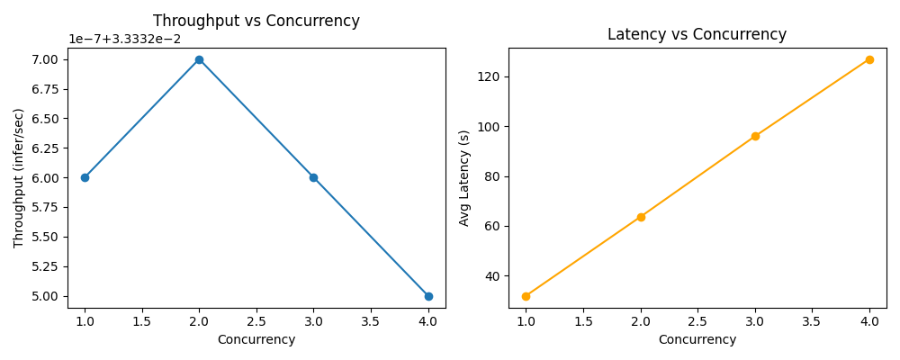

# Tritonserver vLLM Showcase
This repository contains an implementation of a Llama3-8b-Instruct model running on a vLLM python backend, served in an NVIDIA Triton Inference Server. The repository contains 3 endpoints, `llama3-8b-instruct`, which serves the vLLM Llama model's generate call, `llama_postprocess`, which provides output censorship and gaurdrails, and `llama_bls_ensemble`, which provides input filtering and gaurdrails, as well as a manual ensemble pipeline using Business Logic Scripting (BLS). BLS allows users to execute inference requests on other models being served by Triton as a part of executing a Triton Python model. Triton Inference Server supports ensemble models, which combine multiple endpoints under the hood, utilizing unified memory to prevent data copies. It seems that ensemble models are not yet supported in combination with the vLLM backend, so BLS is used here to provide a single API endpoint to interact with the full ensemble pipeline. This introduces some minor inefficiencies regarding scheduling and blocking requests, which can be bypassed by scaling up the `llama_bls_ensemble` endpoint.

All code is located in the `src` directory. An entrypoint to ensure model download and caching from the Huggingfacehub is provided in `src/tritonserver/entrypoint.sh`. All API endpoint configurations and code is located in `src/tritonserver/model_repository`. The folder structure in model_repository follows a rigid scheme, where every high level folder in `src/tritonserver/model_repository` denotes an endpoint, inside of which is a config.pbtxt that determines details such as the endpoint name, platform, tensor names, shapes and types. Endpoints within Tritonserver are versioned, so the number subfolders within endpoint folders contain a version of an endpoint, inside which models, further configurations and code for python backend endpoints can be stored. Python backend endpoints (`llama_bls_ensemble` and `llama_postprocess`) excecute custom python code and can interact with the tensors using the `triton_python_backend_utils` package. Tensor parsing, encoding and BLS logic is handled within the `model.py` files for python endpoints, and simpler data processing operations are imported from seperate files. This allows for simple unittesting on the helper functions for functionalities such as checking for profanity, and leaves testing the larger BLS and tensor decoding/unpacking to integration tests, ensuring an ecosystem of tests that is flexible and maintainable.

### Input and output validation
Simple model gaurdrails for input validation and output censorships are implemented using a banned sentence/word list and the `better_profanity` package. I have set up the input validation and output censorship as helper functions to easily import and integrate them into the python backend endpoints within the tritonserver. More advanced input and output sanitation can be achieved by using larger established gaurdrail ecosystems such as [langchain](https://www.guardrailsai.com/docs/integrations/langchain) or [gaurdrails](https://www.guardrailsai.com/). Additionally, improved more advanced profanity and toxic language detection models such as transformer models finetuned for these tasks could be employed for input/output validation by simply adding them as their own endpoint and integration them into the BLS ensemble. Finally, pre-constructing the prompt for the main LLM could prevent harmful injection and dangerous outputs, which could be implemented by providing a set of instructions prior to the user query, which would be inserted after this. These forms of input/output sanitation are out of scope for this repo.

## Setup
As this project utilizes NVIDIA Triton Inference Server and vLLM, it requires some installations on the host machine and NVIDIA GPUs with enough memory to fit the LLM. This project was developed and tested on an NVIDIA 4090 GPU with CUDA 12.6.

Prior to building the container, ensure you have a huggingface account with access to the Llama-3-8B model and store the HF token in the .env file in this repository. The tritonserver entrypoint will then handle the model download prior to launching and saving it locally for future use.

## Run commands
Spin up the Tritonserver API with:

```docker
docker compose -f docker/docker-compose.yml  --env-file ./.env up --build
```

### Running the tests
For the unittests, first build them and them run them with:
```bash
docker build -f docker/Dockerfile.unittests -t vllm_tritonserver_unittests .
docker run -it vllm_tritonserver_unittests 
```

Run the integration tests with:
```bash
docker compose -f docker/docker-compose-tests.yml  --env-file ./.env up --build
```

## Performance Analyzer
Triton Inference Server has access to the [Triton Performance Analyzer tool](https://github.com/triton-inference-server/perf_analyzer/blob/r25.01/README.md). This CLI tool aids in optimizing inference performance of models running on Triton Inference Server by measuring changes in performance when experimenting with different optimization strategies.

Two analysis are provided in this section, a concurrency analysis and an analysis on max_token settings for requests. Both raw outputs of the performance analyzer runs can be found in `tests/perf_analyzer/perf_analyzer_runs_raw.txt`. This file contains outputs generated by the perf analyzer tool denoting concurrency, request counts, throughput, average latency, p50,p90, p95 and p99 latency, average http time, succes rate, average request latency. The most relevant results are presented below in two seperate tables:

[concurrency sweep table]

Most notable, throughput remains ~ 0.033 req/s across concurrency levels. This average about 1 request every ~30 seconds. Doubling concurrency doubles latency, indicating a linear scaling. GPU usage floats around 70-80% with ~22/24gb memory used, as denoted by nvidia-smi. This indicates that the GPUs used are almost fully satiated running 1 model per GPU, resulting in higher concurrency only increasing queue time. For this configuration with this hardware, concurrency=1 is the optimal setting. This is amplified by the missing support of ensemble models in combination with the vLLM backend in tritonserver, deadlocking the `llama_bls_ensemble` endpoint while it is making it's Business Logic Scripting calls to the `llama3-8b-instruct` and `llama_postprocess` endpoints. Increasing the instances of the `llama_bls_ensemble` to two might improve this behaviour, but removing the BLS logic in favor of an ensemble pipeline would eliminate the deadlock completely.

[request size variation]
[Latency vs max tokens](docs/latency_vs_max_tokens.png)
Performance analysis was generated using the same prompt with differing `max_tokens` for the generated output. The requests were sent with the small, medium and large jsons in the `tests/perf_analyzer` directory, ranging from 50 to 600 max tokens. As the max tokens amount increases, the latency scales roughly linear with it and the throughput drops. Doubling output token length roughly doubles generation time for a single request.

In order to use the performance analyzer, first pull the docker image with: `docker pull nvcr.io/nvidia/tritonserver:24.09-py3-sdk`. After pulling the container, launch the container with:
```docker
docker run --gpus all --rm -it --net host nvcr.io/nvidia/tritonserver:24.09-py3-sdk
```
When in the container, run the performance analyzer with:

```bash
perf_analyzer -m llama_bls_ensemble \
  --concurrency-range 1:8 \
  --request-distribution constant \
  --shared-memory none \
  --output-shared-memory-size 0 \
  --max-threads 16 \
  --measurement-interval 50000 \
  -i http 
```

To run the perf_analyzer on differing max_token presets, provide the data json files in `tests/perf_analyzer` as a volume to the triton py3-sdk container and run the following command, swapping out the files to cycle through settings:

```bash
perf_analyzer   -m llama_bls_ensemble   --input-data data_large.json   --concurrency-range 1:1   --measurement-interval=50000 
```


